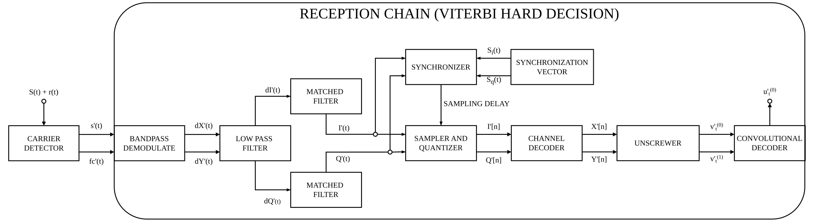
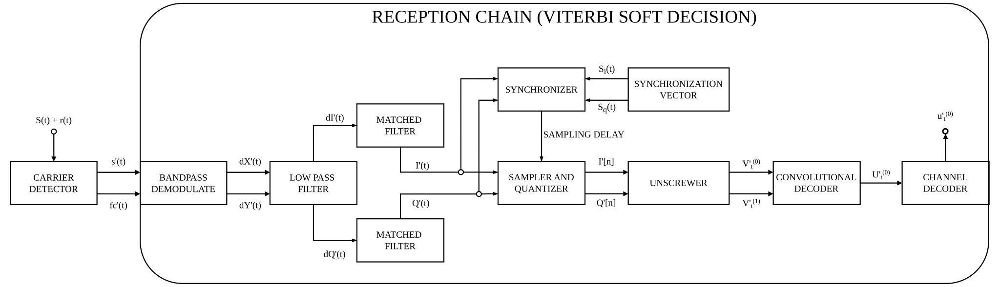

# Receptor

O processo de recepção é dividido em duas etapas, a detecção de portadora, responsável por verificar o sinal recebido e identificar para cada segmento de tempo as portadoras presentes, e a cadeia de recepção, responsavel por receber um segmento de sinal e realizar o processo de recepção a fim de recuperar o vetor de dados $u_t^{(0)}$, conforme o diagrama de blocos abaixo.

<!--  -->

## Detector de Portadora

::: detector.CarrierDetector.__init__
    options:
        extra:
            show_docstring: true
            show_signature: true

## Cadeia de Recepção

::: receiver.Receiver
    options:
        extra:
            show_docstring: true
            show_signature: true