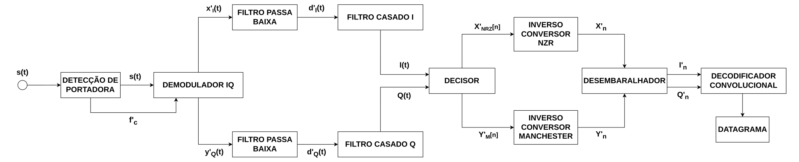

# Receptor

## Detector de Portadora

::: detector.CarrierDetector.__init__
    options:
        extra:
            show_docstring: true
            show_signature: true

## Cadeia de Recepção

::: receiver.Receiver
    options:
        extra:
            show_docstring: true
            show_signature: true